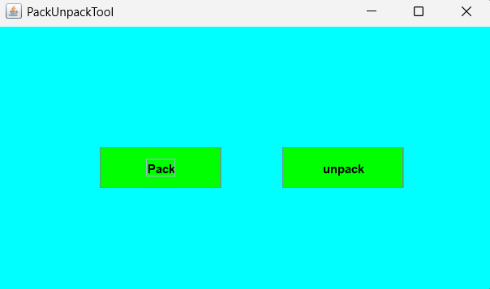
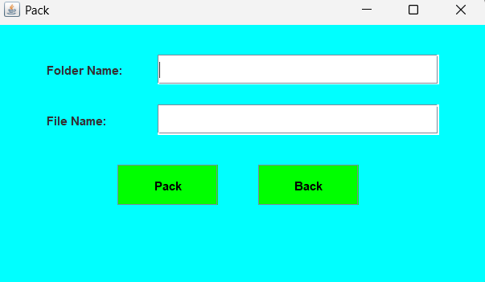
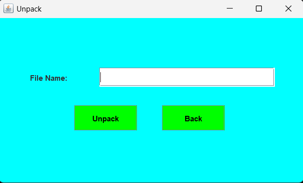

# PackUnpackTool

This is a simple Java-based Pack-Unpack tool that allows users to package multiple files into a single archive and later unpack them. It provides a basic GUI for performing the operations.

## Features

- Efficiently pack multiple files into a single archive  
- Seamlessly unpack archived files with ease  
- Simple and lightweight user interface for intuitive operation  
- Reduces network traffic by minimizing file transfer overhead  
- Enables file transfers in environments that restrict multiple attachments by packaging them into a single archive


## Directory Structure

- `Src/manifest.txt` – Manifest file used for JAR packaging
- `out/` – Compiled `.class` files and the final `PackUnpackTool.jar`
- `Src/` – Contains source code

## How to Compile

1. Ensure Java JDK is installed and configured in your system.
2. Open terminal or command prompt.
3. Navigate to the `Src` directory and compile the source files:

```
javac -d ../out *.java
```

## How to Create JAR

1. Navigate to the `out` directory:

```
cd out
```

2. Run the JAR command:

```
jar cfm PackUnpackTool.jar ../Src/manifest.txt *
```

Ensure that `manifest.txt` is correctly referencing the `Main-Class`.

## How to Run

1. In the terminal, navigate to the `out` directory.
2. Run the JAR file:

```
java -jar PackUnpackTool.jar
```

## Screenshots

Below are example screenshots showing the functionality.

### Launch Screen


### Packing Files


### Unpacking Files

